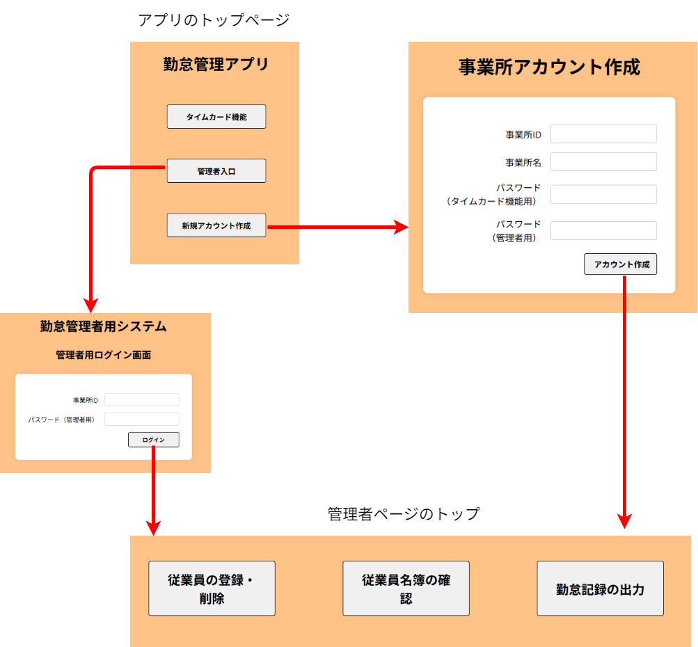
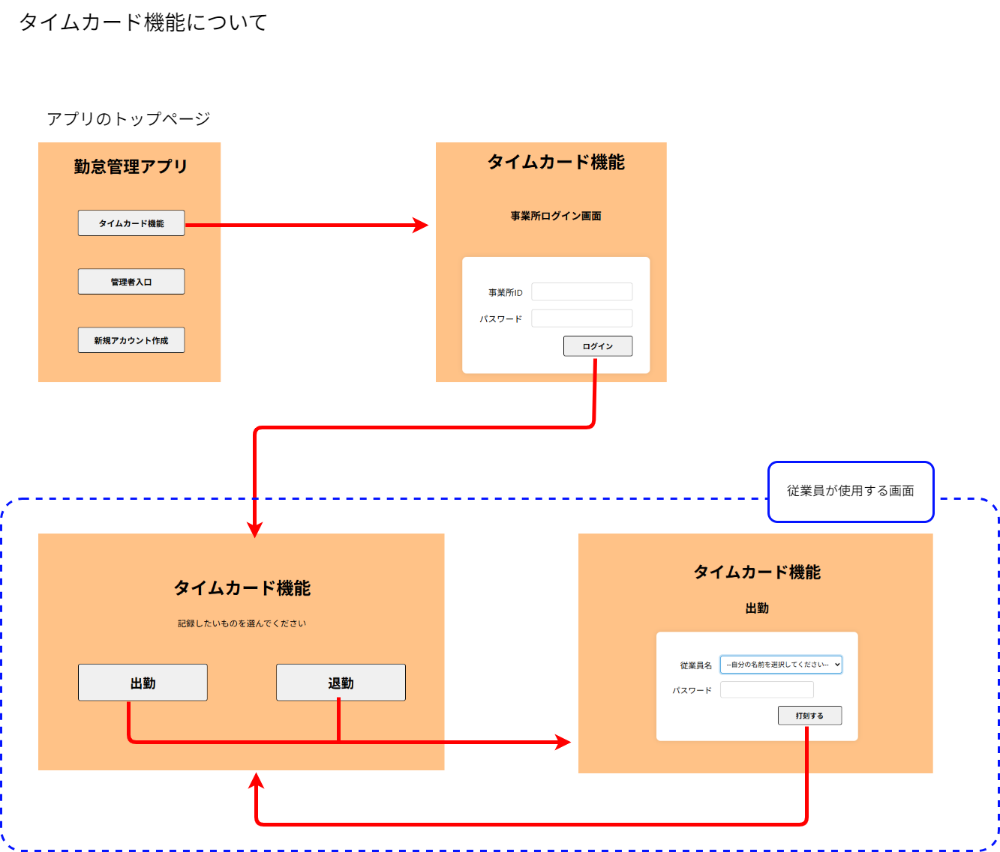
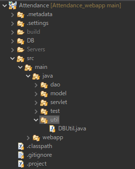

# Attendance_webapp
勤怠管理Webアプリ

# 作成にいたる経緯

このアプリは職業訓練の実習で作成したものです。
実習のテーマは訓練校の関連会社の説明やHPを見て、その会社が必要としているものを受講生みずから考えて作成することです。
私は、勤怠管理はタイムカードを使っていて、集計はExcelに打ち込んでしているという話を聞いて、今回のアプリを作ろうと考えました。

# このアプリの目的

このアプリの主な目的は、従業員の出勤時間と退勤時間を記録し、その記録をExcelで出力することです。
そのためにタイムカードの機能もつけています。
なお、事業所規模は10人程度を想定しています。

# このアプリの使い方

## アカウントの作成

最初に事業所アカウントを作成してください。
パスワードは「タイムカード機能」用と「管理者ページ」用の２種類作成します。
アカウントを作成すると自動的にログインし、管理者ページのトップへ移動します。

---

## 管理者ページ

### 従業員の登録

従業員の登録は名前とパスワードを設定します。自動的にID番号が振られるので、同姓同名がいる場合はID番号で特定できます。
従業員のIDとパスワードは「従業員名簿の確認」から確認できます。
従業員のパスワードに使える文字数などは特に制限していません。目的が従業員が誤って他人の勤怠を記録してしまうことにあるからです。
登録したら、従業員にIDとパスワードを伝えてください。

### 従業員の削除

この機能を使うと、当該従業員の勤怠記録を含めたすべてのデータが削除されます。

### 勤怠状況の出力

「勤怠記録の出力」から日付の範囲を指定して従業員全員分の出勤時間と退勤時間の記録を表示させることができます。また、Excelファイルでダウンロードできます。
なお、もし二重に打刻されていた場合、出勤はより早い時間を、退勤はより遅い時間を採用します。

---

## タイムカード機能

この機能はタブレットで利用することを想定しています。
管理者もしくは担当者がタイムカード機能へログインしてください。「出勤」または「退勤」を選択する画面になります。
その後、通常タイムカードを設置する場所へタブレットを設置します。
従業員はタイムカードを押すのとほぼ変わらず勤怠を記録することができます。
なお、この機能のセッションスコープの有効期間は48時間に設定しています。

# このアプリを動かすのに必要な環境
## 開発環境
* Eclipse2025(pleiades All in One)
* Tomcat10(Java21)
* H2DataBase
* Visual Studio Code

## 使用ライブラリ一覧

### Excel関連（Apache POI）
Excelファイル（.xls / .xlsx）の読み書きに使用するライブラリ群です。

- [`poi-5.2.3.jar`](https://poi.apache.org/download.html)  
  Apache POIの基本ライブラリ（HSSF/XSSFのサポート）

- [`poi-ooxml-5.2.3.jar`](https://poi.apache.org/download.html)  
  Office Open XML（.xlsx）の読み書き対応

- [`poi-ooxml-lite-5.2.3.jar`](https://poi.apache.org/download.html)  
  軽量化されたOOXMLサポートライブラリ

- [`xmlbeans-5.1.1.jar`](https://poi.apache.org/download.html)  
  XMLバインディング用ライブラリ（POI依存）

- [`curvesapi-1.07.jar`](https://poi.apache.org/download.html)  
  数学関数（ベジェ曲線など）のサポート。POIの依存ライブラリ

- [`commons-io-2.11.0.jar`](https://commons.apache.org/proper/commons-io/)  
  IO処理用ユーティリティ

- [`commons-logging-1.2.jar`](https://commons.apache.org/proper/commons-logging/)  
  ロギングの抽象化（Log4jなどと連携）

- [`commons-collections4-4.4.jar`](https://commons.apache.org/proper/commons-collections/)  
  拡張コレクションフレームワーク

- [`commons-compress-1.21.jar`](https://commons.apache.org/proper/commons-compress/)  
  圧縮ファイルの読み書き（ZIP、7z等）

- [`log4j-api-2.18.0.jar`](https://logging.apache.org/log4j/2.x/)  
  ロギング用API（Log4j 2）

- [`log4j-core-2.18.0.jar`](https://logging.apache.org/log4j/2.x/)  
  ログ出力の実装部分（Log4j 2）

---

### JSON関連（Jackson）
JavaオブジェクトとJSONデータの相互変換に使用します。

- [`jackson-core-2.18.3.jar`](https://mvnrepository.com/artifact/com.fasterxml.jackson.core/jackson-core/2.18.3)  
  JSONストリーム処理の基盤

- [`jackson-databind-2.18.3.jar`](https://mvnrepository.com/artifact/com.fasterxml.jackson.core/jackson-databind/2.18.3)  
  Javaオブジェクトとのマッピング処理（データバインディング）

- [`jackson-annotations-2.18.3.jar`](https://mvnrepository.com/artifact/com.fasterxml.jackson.core/jackson-annotations/2.18.3)  
  アノテーションによるシリアライズ制御

- [`jackson-datatype-jsr310-2.17.0.jar`](https://mvnrepository.com/artifact/com.fasterxml.jackson.datatype/jackson-datatype-jsr310/2.17.0)  
  Java 8の日時API（LocalDateTimeなど）対応

---

### JSTL関連（Jakarta）
JSPで使うタグライブラリやJSPの標準APIです。

- [`jakarta.servlet.jsp-api-3.1.1.jar`](https://mvnrepository.com/artifact/jakarta.servlet.jsp/jakarta.servlet.jsp-api/3.1.1)  
  JSP仕様のAPIライブラリ

- [`jakarta.servlet.jsp.jstl-api-3.0.0.jar`](https://mvnrepository.com/artifact/jakarta.servlet.jsp.jstl/jakarta.servlet.jsp.jstl-api/3.0.0)  
  JSTL（JSP Standard Tag Library）のAPI

---

### データベース関連（H2 Database）
組み込み型の軽量データベースです。開発・テスト用途に適しています。

- [`h2-2.3.232.jar`](https://www.h2database.com/html/download.html)  
  Javaで動作する組み込みSQLデータベースエンジン

---

# 注意事項
## データベースについて
新しくデータベースを作成する場合は「sql文」フォルダにあるcreate_table.sqlに記述されているSQLを利用してください。
利用する環境に合わせて、DBUtil.javaファイルのDRIVER、URL、USER、PASSWORDの値を変更してください。

# 作成者情報
* 作成者： 倉　悠史
* 所属：なし

