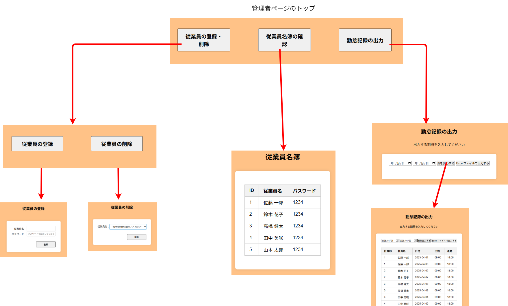

# Attendance_webapp
勤怠管理Webアプリ

# 作成にいたる経緯

このアプリは職業訓練の実習で作成したものです。
実習のテーマは訓練校の関連会社の説明やHPを見て、その会社が必要としているものを受講生みずから考えて作成することです。
私は、勤怠管理はタイムカードを使っていて、集計はExcelに打ち込んでしているという話を聞いて、今回のアプリを作ろうと考えました。

# 制作日程（5/13～5/28）

| 日付   | 主な取り組み |
|--------|--------------|
| 5/13   | 訓練校の関連会社から説明を受けて、作るものを考え始める。 |
| 5/15   | 本格的に制作開始。設計図とSQL文を作成。 |
| 5/16   | タイムカード機能の開発を進める。 |
| 5/20   | タイムカード機能をほぼ完成させ、従業員の登録と削除機能の作成へ移る。 |
| 5/21   | 従業員の登録などの機能、管理者ログイン機能、従業員名簿表示機能がほぼ完成。 |
| 5/22   | 勤怠状況のウェブページ上での出力とExcel出力を作成。 |
| 5/23   | 事業所アカウント作成機能、バリデーションチェック、パスワードハッシュ化機能を作成。 |
| 5/26   | 画面のデザインを行う。 |
| 5/27   | READMEを作成。テストしながら調整していく。 |
| 5/28   | 最終チェックの完了。 |


# このアプリの目的

このアプリの主な目的は、従業員の出勤時間と退勤時間を記録し、その記録をExcelで出力することです。
そのためにタイムカードの機能もつけています。
なお、事業所規模は10人程度を想定しています。

# このアプリの使い方


## アカウントの作成


最初に事業所アカウントを作成してください。
パスワードは「タイムカード機能」用と「管理者ページ」用の２種類作成します。
アカウントを作成すると自動的にログインし、管理者ページのトップへ移動します。

---

## 管理者ページ



### 従業員の登録

従業員の登録は名前とパスワードを設定します。自動的にID番号が振られるので、同姓同名がいる場合はID番号で特定できます。
従業員のIDとパスワードは「従業員名簿の確認」から確認できます。
従業員のパスワードに使える文字数などは特に制限していません。目的が従業員が誤って他人の勤怠を記録してしまうことにあるからです。
登録したら、従業員にIDとパスワードを伝えてください。

### 従業員の削除

この機能を使うと、当該従業員の勤怠記録を含めたすべてのデータが削除されます。

### 勤怠状況の出力

「勤怠記録の出力」から日付の範囲を指定して従業員全員分の出勤時間と退勤時間の記録を表示させることができます。また、Excelファイルでダウンロードできます。
なお、もし二重に打刻されていた場合、出勤はより早い時間を、退勤はより遅い時間を採用します。

---

## タイムカード機能


この機能はタブレットで利用することを想定しています。
管理者もしくは担当者がタイムカード機能へログインしてください。「出勤」または「退勤」を選択する画面になります。
その後、通常タイムカードを設置する場所へタブレットを設置します。
従業員はタイムカードを押すのとほぼ変わらず勤怠を記録することができます。
なお、この機能のセッションスコープの有効期間は48時間に設定しています。

# ディレクトリ構成
```
Attendance_webapp
├── README.md
├── sql文
├── ドキュメント
└── Attendance
    └── src
        └── main
            ├── java
            │   ├── servlet
            │   ├── dao
            │   ├── model
            │   └── util
            │       └── DBUtil.java
            └── webapp
                ├── css
                ├── WEB-INF
                │  ├── jsp
                │  └── lib
                └── index.jsp
```

# このアプリを動かすのに必要な環境
## 開発環境
* Eclipse2025(pleiades All in One)
* Tomcat10(Java21)
* H2DataBase
* Visual Studio Code


## 使用ライブラリ一覧

### Excel関連（Apache POI）
Excelファイル（.xls / .xlsx）の読み書きに使用するライブラリ群です。

- [`poi-5.2.3.jar`](https://poi.apache.org/download.html)  
  Apache POIの基本ライブラリ（HSSF/XSSFのサポート）

- [`poi-ooxml-5.2.3.jar`](https://poi.apache.org/download.html)  
  Office Open XML（.xlsx）の読み書き対応

- [`poi-ooxml-lite-5.2.3.jar`](https://poi.apache.org/download.html)  
  軽量化されたOOXMLサポートライブラリ

- [`xmlbeans-5.1.1.jar`](https://poi.apache.org/download.html)  
  XMLバインディング用ライブラリ（POI依存）

- [`curvesapi-1.07.jar`](https://poi.apache.org/download.html)  
  数学関数（ベジェ曲線など）のサポート。POIの依存ライブラリ

- [`commons-io-2.11.0.jar`](https://commons.apache.org/proper/commons-io/)  
  IO処理用ユーティリティ

- [`commons-logging-1.2.jar`](https://commons.apache.org/proper/commons-logging/)  
  ロギングの抽象化（Log4jなどと連携）

- [`commons-collections4-4.4.jar`](https://commons.apache.org/proper/commons-collections/)  
  拡張コレクションフレームワーク

- [`commons-compress-1.21.jar`](https://commons.apache.org/proper/commons-compress/)  
  圧縮ファイルの読み書き（ZIP、7z等）

- [`log4j-api-2.18.0.jar`](https://logging.apache.org/log4j/2.x/)  
  ロギング用API（Log4j 2）

- [`log4j-core-2.18.0.jar`](https://logging.apache.org/log4j/2.x/)  
  ログ出力の実装部分（Log4j 2）

---

### JSON関連（Jackson）
JavaオブジェクトとJSONデータの相互変換に使用します。

- [`jackson-core-2.18.3.jar`](https://mvnrepository.com/artifact/com.fasterxml.jackson.core/jackson-core/2.18.3)  
  JSONストリーム処理の基盤

- [`jackson-databind-2.18.3.jar`](https://mvnrepository.com/artifact/com.fasterxml.jackson.core/jackson-databind/2.18.3)  
  Javaオブジェクトとのマッピング処理（データバインディング）

- [`jackson-annotations-2.18.3.jar`](https://mvnrepository.com/artifact/com.fasterxml.jackson.core/jackson-annotations/2.18.3)  
  アノテーションによるシリアライズ制御

- [`jackson-datatype-jsr310-2.17.0.jar`](https://mvnrepository.com/artifact/com.fasterxml.jackson.datatype/jackson-datatype-jsr310/2.17.0)  
  Java 8の日時API（LocalDateTimeなど）対応

---

### JSTL関連（Jakarta）
JSPで使うタグライブラリやJSPの標準APIです。

- [`jakarta.servlet.jsp-api-3.1.1.jar`](https://mvnrepository.com/artifact/jakarta.servlet.jsp/jakarta.servlet.jsp-api/3.1.1)  
  JSP仕様のAPIライブラリ

- [`jakarta.servlet.jsp.jstl-api-3.0.0.jar`](https://mvnrepository.com/artifact/jakarta.servlet.jsp.jstl/jakarta.servlet.jsp.jstl-api/3.0.0)  
  JSTL（JSP Standard Tag Library）のAPI

---

### データベース関連（H2 Database）
組み込み型の軽量データベースです。開発・テスト用途に適しています。

- [`h2-2.3.232.jar`](https://www.h2database.com/html/download.html)  
  Javaで動作する組み込みSQLデータベースエンジン

---


# 注意事項
## データベースについて
新しくデータベースを作成する場合は「sql文」フォルダにあるcreate_table.sqlに記述されているSQLを利用してください。
利用する環境に合わせて、DBUtil.javaファイルのDRIVER、URL、USER、PASSWORDの値を変更してください。


# 作成者情報
* 作成者： 倉　悠史
* 所属：個人開発（職業訓練実習）

## ライセンスについて

本アプリケーションのソースコードは著作権により保護されています。

以下の行為を禁止します：

- 無断での複製、改変、再配布
- 商用利用（販売・サービス提供・業務使用など）

学習目的または個人利用に限り使用可能です。  
その他の用途については事前に作者の許可を得てください。

Copyright (c) 2025 倉 悠史

## 制作を終えての振り返り


### こだわった点
- アプリ導入の容易性

  もとより複雑なアプリを作成する時間はなかったのですが、画面を見ればわかることを意識しました。

- 処理の失敗をクライアントに通知すること（エラーページを表示させない）
  
  エラーをスローして、クライアント側にメッセージを返すことをしました。

### 気づいたこと
- equalsのオーバーライド

  訓練校で使用したテキストでも強調されていたことですが、DTOなどデータ保持を目的とするクラスのequalsメソッドのオーバーライドの重要性を実感しました。テストでオブジェクトの等価性を確認したときに、フィールドの値が同じオブジェクトであるにもかかわらず等価でないと判定され、「なぜ？」と悩みました。

### 苦労した点
- データベースとの接続

  URLを相対パスにすれば他のPCで利用する場合でもURLを変更しなくても済むと思いましたが、Tomcatとの兼ね合いで予期しないところ（Eclipseをインストールしているフォルダ）にデータベースが作成されてしまいました。最終的には諦めました。


- ログに詳細が出力されないエラー

  サーブレットを扱うと、Eclipseのコンソールに詳細なエラーログが出ないことがあります。たいていは例外をキャッチしてエラーを出力する命令を書いておけば出てきますが、Excel出力機能を作成中に出会ったときは悩みました（原因はライブラリの不足でした）。


### ChatGPTの活用
- 前半はクラスやメソッド、変数の名前を決めるのに活用しました。
- コーディング中はエラーが出た場合の原因を調べるためによくコードを見てもらいました。また、思いついた設計の当否について意見をもらいました。例えば、当初はDAOクラス内でデータベース接続のコードを書くつもりでしたが、何度も書きそうなので、別のクラスに切り出すことについての当否を確認しました。

- 後半では、バリデーションチェック、パスワードハッシュ化、Excel出力を担当するクラス及びメソッドを作成させ、ほぼそのまま採用しました。引数、戻り値、処理が明確であれば、意図したものを作成させることができました。

本当に、学習コストや開発コストが下がるのを感じます。

### やり残しなど
- 単体テストを十分にできなかったこと。

## 職業訓練を終えて
今回受講した職業訓練は１月から５月までの５か月間にわたり、Webアプリ制作を学ぶコースでした。これまでExcelVBA程度しか使えなかったのですが、「プログラマーを目指したい」「そのためには現場でよく使われている言語を学びたい」と思い、受講しました。

どこから学べばいいか分からなかった状況から、体系的に５か月間も集中して学べたのは非常に大きかったです。

訓練後半のサーブレット/JSPの学習に入ったあたりから、敢えてテキストのコードを見ずに自分で考えて書いてみるということを試していました。そこで気づいたのは、「設計がしっかりできていれば、コードを書くことはそれほど難しくない」ということです。講義では設計手法について深く扱う機会は少なかったのですが、良い設計ができるようになりたいと思います。

受講を通して、就職活動のためのポートフォリオを作成することを目標としていたので、今回無事に達成できて良かったです。